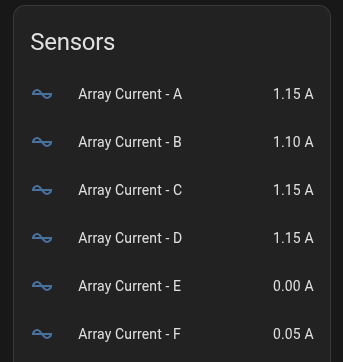
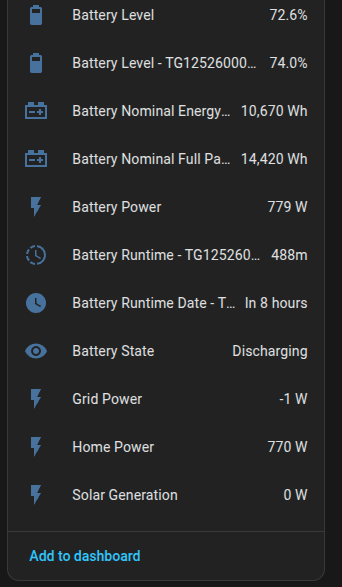
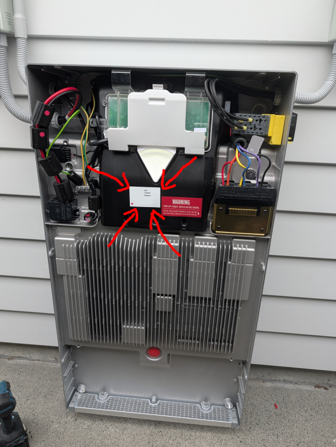

# Tesla Powerwall to Home Assistant Bridge

**Tesla Powerwall to Home Assistant Bridge via MQTT with auto-discovery.**

This tool polls your Tesla Powerwall for real-time data (power flows, battery status, solar strings(arrays), etc.) and
publishes it to an MQTT broker using [Home Assistant MQTT discovery](https://www.home-assistant.io/integrations/mqtt/)
format.

## Features

- **Real-time power monitoring**: Solar generation, grid import/export, home load, battery charge/discharge.
- **Battery details**: SoC, power, estimated runtime (time to charge, time to discharge) per battery.
- **Solar Strings/Arrays**: Voltage, current, power per string/array.
- **Parallel Strings**: Combine strings into single entities for easier monitoring.
- **HA auto-discovery**: Entities appear automatically in Home Assistant.

### Example Entities

|  |  |
|------------------------------------------------|------------------------------------------------|

## Usage

### Run as script

1. Clone the repo
2. Set up a virtual environment (optional but recommended)
    - `python3 -m venv venv`
    - `source venv/bin/activate`
3. Install dependencies: `pip install -r src/requirements.txt`
4. Run the script: `python src/main.py`

### Run as systemd service (Linux)

To easily run the bridge in the background on Linux systems using systemd, you can use the provided install script:

1. Run the install script:
   ```bash
   ./install.sh
   ```
2. Edit the generated `.env` file with your configuration:
   ```bash
   nano .env
   ```
3. Start the service:
   ```bash
   sudo systemctl start powerwall-ha-bridge
   ```

To view logs:

```bash
journalctl -u powerwall-ha-bridge -f
```

If you update the code via `git fetch && git pull`, simply restart the service to use the latest version:

```bash
sudo systemctl restart powerwall-ha-bridge
```

### 1. Connecting to Powerwall

#### Local Connection (Recommended)

You will need the Wi‑Fi password for Powerwall (found behind the glass panel of Powerwall).

Additionally, your computer will need network access to the Powerwall at `192.168.91.1`.   
You can join your computer to the Powerwall’s local Wi‑Fi.



### 2. Running the script

If you are using a local connection, you will need to provide `POWERWALL_GW_PWD` env var to the script.
The value is from the sticker (Wi-Fi password) on the Powerwall.

## Configuration Variables

| Variable                | Description                          | Default Value               |
|-------------------------|--------------------------------------|-----------------------------|
| `POWERWALL_HOST`        | Powerwall IP/hostname (local)        | `192.168.91.1`              |
| `POWERWALL_PASSWORD`    | Powerwall owner API password (cloud) |                             |
| `POWERWALL_EMAIL`       | Tesla account email (cloud)          |                             |
| `POWERWALL_GW_PWD`      | Gateway password (local)             |                             |
| `POWERWALL_TIMEZONE`    | Timezone                             | `$TZ` or `Pacific/Auckland` |
| `MQTT_BROKER`           | MQTT broker host                     | `localhost`                 |
| `MQTT_PORT`             | MQTT port                            | `1883`                      |
| `MQTT_USERNAME`         | MQTT username                        |                             |
| `MQTT_PASSWORD`         | MQTT password                        |                             |
| `MQTT_CLIENT_ID`        | MQTT client ID                       | `powerwall-ha-bridge`       |
| `MQTT_HA_PREFIX`        | HA discovery prefix                  | `homeassistant`             |
| `HA_DEVICE_ID_PREFIX`   | Custom prefix for device id entities | `pw-ha-bridge`              |
| `HA_DEVICE_NAME_PREFIX` | Custom prefix for device name        | `Powerwall`                 |

## Home Assistant Setup

1. Add [MQTT](https://www.home-assistant.io/integrations/mqtt/) integration to your Home Assistant instance.
2. Run this script.
3. Entities will auto-discover under MQTT integration.

## Contributing

1. Fork the repository
2. PR your change
3. Add tests if possible.

## Comparison with other projects/solutions

- [tesla_fleet](https://www.home-assistant.io/integrations/tesla_fleet/)
    - While tesla_fleet offers entities with control capabilities, they are all going via cloud API, where this project
      is going via local API, as a result - we can pull more detailed data.
    - tesla_fleet lacks PV strings/arrays support.

- [pypowerwall](https://github.com/jasonacox/pypowerwall)
    - This project uses pypowerwall under the hood, as 'brains' for handling all communication with Powerwall.
    - However, pypowerwall does not offer out-of-the-box HA integration.

## Acknowledgments

- [pypowerwall](https://github.com/jonasder2te/pypowerwall)
